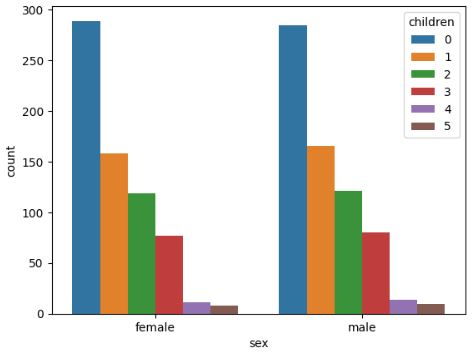

<html lang="en">

<head>
    <meta charset="UTF-8">
    <meta http-equiv="X-UA-Compatible" content="IE=edge">
    <meta name="viewport" content="width=device-width, initial-scale=1.0">
    <title> Regression Machine Learning Project</title>

</head>

<body>
    

        <h1>
            Regression Machine Learning (ML ) Project For Medical Insurance Charges Prediction
        </h1>
    

    

        <h2>General Information About The Project: </h2>
    

    

        <ul>

            <li>The project is written in Python in a Jupyter Notebook format</li>
            <li>The project utilizes multiple ML models to predict the medical insurance charges found at following link: <a
                href="https://www.kaggle.com/datasets/mirichoi0218/insurance"> DataSet Link
                </a>  from kaggle.com </li>

        </ul>
    

    

        <h2>EDA Conclusions Written Information: </h2>
    

    

        <ul>
            <li>There is a total of <b>7</b> features which are: </li>
            <ul>
                <li><b>age</b>, this parameter represents the age of an individual in years </li>
                <li><b>sex</b>, this parameter represents the sex of an individual either Male or Female </li>
                <li><b>bmi</b>, this parameter represents the bmi of an individual as a numerical value</li>
                <li><b>children</b>, this parameter represents the number of children an individual has as a numerical value</li>
                <li><b>smoker</b>, this parameter represents the smoking status of an individual</li>
                <li><b>region</b>, this parameter represents the region an individual lives in</li>
                <li><b>charges</b>, this is the label parameter and it represents each individual's medical costs billed by the health insurance </li>

            </ul>

        </ul>

    

    

        <h2>EDA Conclusions Plots: </h2>
    

    

        <ul>

            <li>A count plot of the "Label" column, which is <b>Charges</b> </li>
            <ul>
                <li>The plot displays that majority of people have medical charges below $20000</li>
                 
      

            </ul>

            <li>A correlation plot between the <b>Charges</b> column & all the other numerical columns </li>
            <ul>
                <li>The highest correlation between the numerical columns and the <b>Charges</b> column happens to be 29.9% for the age column, then, 19.8% for the bmi column, and 6.7% for the childern column</li>
                 
      

            </ul>

            <li>A correlation heatmap between all the numerical features</li>
            <ul>
                <li>The age column seems to have the highest correlation with the charges column and the bmi column</li>
                 
      

            </ul>

            <li>A count plot that analyzes the relationship between the sex and childern columns</li>
            <ul>
                <li>Both males and females have a balanced number of children</li>
                <li>The most number of childern is 0 and the lowest number of childern is 5</li>

                 
      

            </ul>

            <li>A count plot that analyzes the relationship between the sex and smoker columns</li>
            <ul>
                <li>Both males and females have a balanced degree of smoking</li>
                <li>The data contains less smoking individuals</li>

                 
      

            </ul>

            <li>A count plot that analyzes the relationship between the sex and region columns</li>
            <ul>
                <li>all areas have a close number of males and females. However, more males and females are from the Southeast region</li>

                 
      

            </ul>

            <li>A pairplot presenting multiple relationships, while the smoker column is set as a hue</li>
            <ul>
                <li>Changes seem not to increase with increasing the age. However, it increases with smking individuals  </li>
                <li>The distrubtion of age seem to be similar throughout all the ages   </li>
                <li>Non-smokers seem to have more childern    </li>
                 
      

            </ul>

        </ul>

    

    

        <h2>Main Metrics of Evaluation: </h2>
    

    

        <ul>
            <li>The main metrics we focused on was the Root Mean Square Error (RMSE) </li>
            <li>RMSE is measured in the same units as the target variabl</li>
            <li>RMSE is sensitive to outliers and RMSE is most useful when large errors are particularly undesirable </li>

        </ul>

    

    

        <h2>Comparison  of the Algorithms: </h2>
    

    <table style="width:80%">
        <tr>
            <td><b>Algorithm</b></td>
            <td><b>RMSE</b></td>

        </tr>
        <tr>
            <td><b>Linear Regression</b></td>
            <td>43.79% </td>

        </tr>

        <tr>
            <td><b>Polynomial Regression </b></td>
            <td>35.99%</td>

        </tr>

        <tr>
            <td><b>KNN - Regressor </b></td>
            <td>65.63%</td>

        </tr>

        <tr>
            <td><b>SVM-SVR </b></td>
            <td>53.73%</td>

        </tr>

        <tr>
            <td><b>Decision Trees - Adaboost Regressor </b></td>
            <td>35.62%</td>

        </tr>

        <tr>
            <td><b>Decision Trees - GradientBoost Regressor </b></td>
            <td><b>33.86%</b></td>

        </tr>

        <tr>
            <td><b>Random Forest</b></td>
            <td>34.25%</td>

        </tr>

    </table>

        

            <h2>Study Conclusions Metrics of Evaluation: </h2>
        

        

            <ul>
                <li>All the top perfromers had an RMSE of around low to mid 30%. The top performers from best to least best were: </li>
                <ul>
<li>
    Decision Trees with Gradient Boost (RSME = 33.86%)
</li>

<li>
    Random Forest (RMSE 34.25%)
</li>

<li>
    Decision Tree with Adaboost (RMSE = 35.62%)
</li>

<li>
    Polynomial Regression with D =2 (RMSE = 35.99%)
</li>
                </ul>

                <li>The worst perfromers from most worst to least worst were:  </li>
                <ul>
<li>
    KNN Regressor (RMSE = 65.63%)
</li>

<li>
    SVM - SVR (RMSE = 53.73%)
</li>

<li>
    Linear Regression (RMSE = 43.79%)
</li>

            </ul>

 

</body>

</html>
